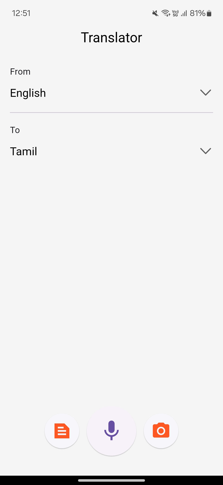
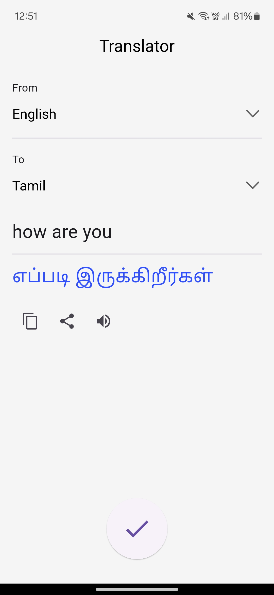

# Language Translator

Language Translator is an application built with Flutter which can translate text, voice and text in images from any language to any selected language using Google Translation API & Google ML Kit to recognize text in Images.

### Screenshots

[](/screenshots/home.jpg)
[](/screenshots/result.jpg)

<br />

### Screen Record

https://github.com/jagadeesh-k-2802/language-translator-flutter/assets/63912668/e72ca2c2-0308-4670-a664-b2e2bdf58db8


### How To Run

1. Clone the repository
```bash
git clone https://github.com/jagadeesh-k-2802/language-translator-flutter.git
```

2. Run the Flutter Project (Make sure Flutter is Installed & configured correctly)
```bash
flutter run
```

3. Since it is Flutter project it can run on multiple platforms like Desktop, Web, Android & iOS.
